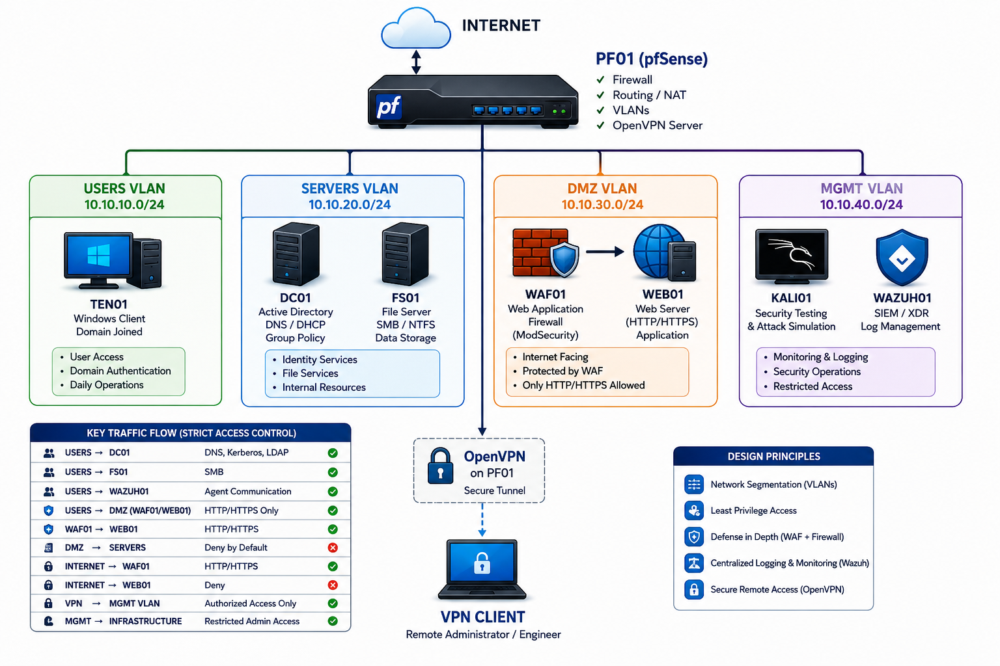

# AESIP-001: Identity Resilience Assessment

> **Atlas Enterprise Security Improvement Program (AESIP)**  
> A simulated enterprise security assessment focused on measuring how far an attacker can progress after compromise of a standard employee workstation.



## Executive Summary

### Objective

Assess whether a compromised employee workstation can access, enumerate, or escalate toward critical Atlas infrastructure.

### Assessment Scenario

| Attribute | Value |
|---|---|
| User | `atlas.sarah` |
| Host | `CLIENT` |
| IP | `10.10.10.102` |
| VLAN | USERS — `10.10.10.0/24` |
| Privilege | Standard Domain User |

### Key Finding

**F-001 — Domain Administrator on User Workstation**

During the initial assessment, testing assumptions were found to be invalid because the workstation was logged on using a Domain Administrator account. This created a Tier-0 administrative exposure risk: compromise of the user endpoint could expose privileged credentials and potentially enable enterprise-wide compromise.

**Severity: HIGH**

```text
Compromised Workstation
        ↓
Credential Theft
        ↓
Domain Administrator Exposure
        ↓
Potential Full Domain Compromise
```

A dedicated low-privilege testing profile (`atlas.sarah`) was created to establish a realistic attacker position.

## Overall Conclusion

The assessment demonstrated effective authorization boundaries for the standard-user scenario. The low-privilege user could discover enterprise resources and reach the file server but could not access Finance, HR, or IT departmental data. The attack path terminated at authorization controls, while the Public share remained accessible as designed.

**Overall Score: 82 / 100 — Moderately Mature**

## Validated Attack Path

```text
atlas.sarah
      │
      ▼
CLIENT (10.10.10.102)
      │
      ▼
FS01
      │
      ├── Finance  ❌ Access Denied
      ├── HR       ❌ Access Denied
      ├── IT       ❌ Access Denied
      └── Public   ✅ Read / Write
```

## Scope

| System | Function |
|---|---|
| CLIENT | User workstation |
| DC01 | Domain Controller |
| FS01 | File Server |
| PF01 | pfSense firewall |
| WAZUH01 | SIEM / XDR |
| WAF01 | Web Application Firewall |
| WEB01 | Web Application |

Assessment focus: Identity Security, Domain Exposure, Authorization Controls, Attack Path Mapping, and Access Validation.

## Key Results

- Identified and documented Tier-0 administrative exposure on a user workstation.
- Created a dedicated standard-user attacker profile: `atlas.sarah`.
- Validated DNS and Domain Controller discovery.
- Validated Kerberos ticket acquisition and domain authentication.
- Enumerated authorized Active Directory information and shares.
- Confirmed SMB reachability to FS01.
- Confirmed access to SYSVOL and NETLOGON as part of normal domain functionality.
- Confirmed Finance, HR, and IT data remained inaccessible to the standard user.
- Confirmed Public share read/write access operated as designed.
- Reviewed Public share ACLs.

## Assessment Methodology

```text
Build
  ↓
Assess
  ↓
Discover
  ↓
Validate
  ↓
Analyze
  ↓
Document
  ↓
Improve
```

## Repository Structure

```text
AESIP-001-Identity-Resilience-Assessment/
├── README.md
├── architecture/
│   └── atlas-core-enterprise-architecture.png
├── commands/
│   └── assessment-commands.md
├── docs/
│   ├── assessment-scope.md
│   ├── attack-path-analysis.md
│   ├── evidence-register.md
│   ├── findings-register.md
│   ├── positive-controls.md
│   └── remediation-roadmap.md
├── evidence/
│   └── README.md
└── reports/
    └── AESIP-001-final-report.md
```

## Disclaimer

All testing documented in this repository was performed against an authorized, isolated lab environment built for security learning and validation. No unauthorized systems were targeted.
